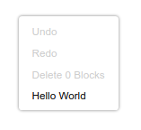

import ClassBlock from '@site/src/components/ClassBlock';

# Customizing context menus

## 3. Add a context menu item

In this section you will create a very basic `Blockly.ContextMenuRegistry.RegistryItem`, then register it to display when you open a context menu on the workspace, a block, or a comment.

### The RegistryItem

A context menu consists of one or more menu options that a user can select. Blockly stores information about menu option as items in a registry. You can think of the _registry items_ as templates for constructing _menu options_. When the user opens a context menu, Blockly retrieves all of the registry items that apply to the current context and uses them to construct a list of menu options.

Each item in the registry has several properties:

- `displayText`: The text to show in the menu. Either a string, or HTML, or a function that returns either of the former.
- `preconditionFn`: Function that returns one of `'enabled'`, `'disabled'`, or `'hidden'` to determine whether and how the menu option should be rendered.
- `callback`: A function called when the menu option is selected.
- `id`: A unique string id for the item.
- `weight`: A number that determines the sort order of the option. Options with higher weights appear later in the context menu.

We will discuss these in detail in later sections of the codelab.

### Make a RegistryItem

Add a function to `index.js` named `registerHelloWorldItem`. Create a new registry item in your function:

```js
function registerHelloWorldItem() {
  const helloWorldItem = {
    displayText: 'Hello World',
    preconditionFn: function(scope) {
      return 'enabled';
    },
    callback: function(scope) {
    },
    id: 'hello_world',
    weight: 100,
  };
}
```

Call your function from `start`:

```js
function start() {
  registerHelloWorldItem();

  Blockly.ContextMenuItems.registerCommentOptions();
  // Create main workspace.
  workspace = Blockly.inject('blocklyDiv',
    {
      toolbox: toolboxSimple,
    });
}
```

### Register it

Next, register your item with Blockly:

```js
function registerHelloWorldItem() {
  const helloWorldItem = {
    // ...
  };
  Blockly.ContextMenuRegistry.registry.register(helloWorldItem);
}
```

:::note
you will never need to make a new `ContextMenuRegistry`. Always use the singleton `Blockly.ContextMenuRegistry.registry`.
:::

### Test it

Reload your web page and open a context menu on the workspace (right-click with a mouse, or press `Ctrl+Enter` (Windows) or `Command+Enter` (Mac) if you are navigating Blockly with the keyboard). You should see a new option labeled "Hello World" at the bottom of the context menu.

<ClassBlock className="codelabImages">  </ClassBlock>

Next, drag a block onto the workspace and open a context menu on the block. You'll see "Hello World" at the bottom of the block's context menu. Finally, open a context menu on the workspace and create a comment, then open a context menu on the comment's header. "Hello World" should be at the bottom of the context menu.
