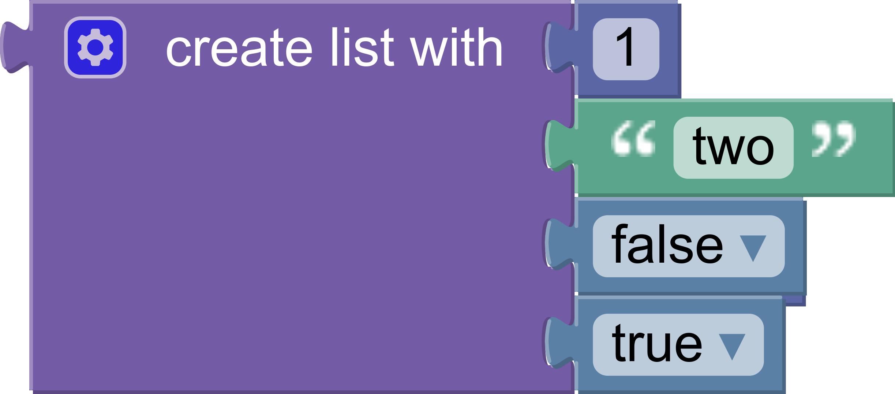

# Build a custom generator

## 7. Array block generator

This step will build the generator for the array block. You will learn how to indent code and handle a variable number of inputs.

The array block uses a mutator to dynamically change the number of inputs it has.



The generated code looks like:

```json
[
  1,
  "two",
  false,
  true
]
```

As with member blocks, there are no restrictions on the types of blocks connected to inputs.

### Gather values

Each value input on the block has a name: `ADD0`, `ADD1`, etc. Use `valueToCode` in a loop to build an array of values:

```js
const values = [];
for (let i = 0; i < block.itemCount_; i++) {
  const valueCode = generator.valueToCode(block, 'ADD' + i,
      Order.ATOMIC);
  if (valueCode) {
    values.push(valueCode);
  }
}
```

Notice that the code skips empty inputs by checking if `valueCode` is `null`.

To include empty inputs, use the string `'null'` as the value:

```js
const values = [];
for (let i = 0; i < block.itemCount_; i++) {
  const valueCode =  generator.valueToCode(block, 'ADD' + i,
      Order.ATOMIC) || 'null';
  values.push(valueCode);
}
```

### Format

At this point `values` is an array of `string`s. The strings contain the generated code for each input.

Convert the list into a single `string`, with a comma and newline separating each element:

```js
const valueString = values.join(',\n');
```

Next, use `prefixLines` to add indentation at the beginning of each line:

```js
const indentedValueString =
    generator.prefixLines(valueString, generator.INDENT);
```

`INDENT` is a property on the generator. It defaults to two spaces, but language generators may override it to increase indent or change to tabs.

Finally, wrap the indented values in brackets and return the string:

```js
const codeString = '[\n' + indentedValueString + '\n]';
return [codeString, Order.ATOMIC];
```

### Putting it all together

Here is the final array block generator:

```js
jsonGenerator.forBlock['lists_create_with'] = function(block, generator) {
  const values = [];
  for (let i = 0; i < block.itemCount_; i++) {
    const valueCode = generator.valueToCode(block, 'ADD' + i,
        Order.ATOMIC);
    if (valueCode) {
      values.push(valueCode);
    }
  }
  const valueString = values.join(',\n');
  const indentedValueString =
      generator.prefixLines(valueString, generator.INDENT);
  const codeString = '[\n' + indentedValueString + '\n]';
  return [codeString, Order.ATOMIC];
};
```

### Test it

Test the block generator by adding an array to the onscreen blocks and populating it.

What code does it generate if there are no inputs?

What if there are five inputs, one of which is empty?