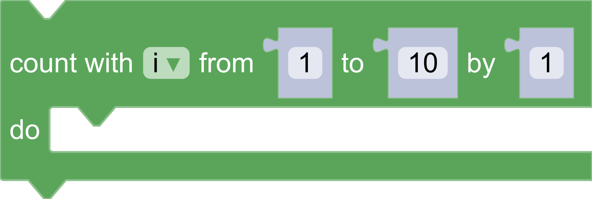

# Build custom renderers

## 5. Override constants

A **ConstantsProvider** holds all rendering-related constants.  This includes sizing information and colours. Blockly provides a base **ConstantsProvider** with all required fields set to default values.

The **ConstantsProvider** `constructor()` sets all static properties, such as `NOTCH_WIDTH` and `NOTCH_HEIGHT`. For a full list of properties, see [constants.ts](https://github.com/RaspberryPiFoundation/blockly/blob/main/core/renderers/common/constants.ts).

Only override the necessary subset of the constants, rather than all of them. To do so:
- Define a constants provider that extends the base `ConstantProvider`.
- Call the superclass `super()` in the `constructor()`.
- Set individual properties.

Add this above the `CustomRenderer` definition in `src/renderers/custom.js`:

```js
class CustomConstantProvider extends Blockly.blockRendering.ConstantProvider {
  constructor() {
    // Set up all of the constants from the base provider.
    super();

    // Override a few properties.
    /**
     * The width of the notch used for previous and next connections.
     * @type {number}
     * @override
     */
    this.NOTCH_WIDTH = 20;

    /**
     * The height of the notch used for previous and next connections.
     * @type {number}
     * @override
     */
    this.NOTCH_HEIGHT = 10;

    /**
     * Rounded corner radius.
     * @type {number}
     * @override
     */
    this.CORNER_RADIUS = 2;

    /**
     * The height of the puzzle tab used for input and output connections.
     * @type {number}
     * @override
     */
    this.TAB_HEIGHT = 8;
  }
}
```

To use the new **CustomConstantProvider**, override `makeConstants_()` inside the `CustomRenderer` class. Below the `constructor()`, add:

```js
  /**
   * @override
   */
  makeConstants_() {
    return new CustomConstantProvider();
  }
```

### The result

Return to the browser, click on the `Loops` entry, and drag out a repeat block.  The resulting block should have triangular previous and next connections, and skinny input and output connections. Note that the general shapes of the connections have not changed--only parameters such as width and height.

