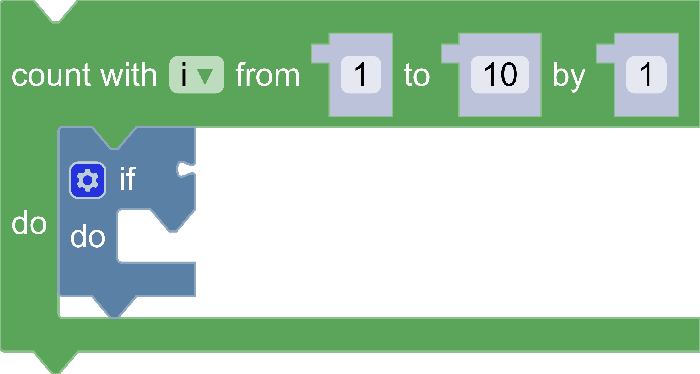

# Build custom renderers

## 8. Typed connection shapes

This step will create a renderer that sets connection shapes at runtime based on a connection's type checks. It will use the default connection shapes and the shapes defined in the previous steps.

### Override `shapeFor(connection)`

Override the `shapeFor(connection)` function in the `CustomConstantProvider` class definition to return a different connection shape based on the `checks` returned from `connection.getCheck()`. Note the previous definition of `shapeFor(connection)` created in previous steps will need to be deleted.

The new definition of `shapeFor(connection)` will:
- Return a rectangular tab for inputs and outputs that accept `Number`s and `String`s.
- Return the default puzzle tab for all other inputs and outputs.
- Return the normal notch for all previous and next connections.

```js
/**
 * @override
 */
shapeFor(connection) {
  var checks = connection.getCheck();
  switch (connection.type) {
    case Blockly.INPUT_VALUE:
    case Blockly.OUTPUT_VALUE:
      if (checks && checks.includes('Number')) {
        return this.RECT_INPUT_OUTPUT;
      }
      if (checks && checks.includes('String')) {
        return this.RECT_INPUT_OUTPUT;
      }
      return this.PUZZLE_TAB;
    case Blockly.PREVIOUS_STATEMENT:
    case Blockly.NEXT_STATEMENT:
      return this.NOTCH;
    default:
      throw Error('Unknown connection type');
  }
```

### The result

Take these steps to fully test this change in the browser:
1. Click on the `Loops` entry and drag out a repeat block.
1. Click on the `Logic` entry and drag the conditional `if` block into the repeat block that was placed on the workspace in the previous step.

There should be an entry similar to the screenshot below, in which the `Number` inputs and outputs are rectangular, but the boolean input on the `if` block is a puzzle tab.
