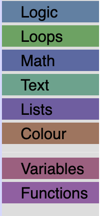
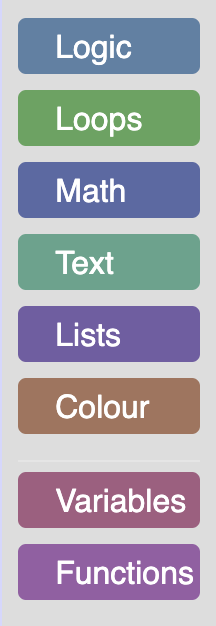

import ClassBlock from '@site/src/components/ClassBlock';

# Customizing a Blockly toolbox

## 3. Change the look of a category

### Change the background of the category

In the default `ToolboxCategory` class, the `addColourBorder_` method adds a strip of color next
to the category name. We can override this method in order to add colour to the entire category div.

Add the following code to your `CustomCategory` class.
```js
/** @override */
addColourBorder_(colour){
  this.rowDiv_.style.backgroundColor = colour;
}
```
The `colour` passed in is calculated from either the `categorystyle` or the `colour`
attribute set on the category definition.

For example, the "Logic" category definition looks like:
```xml
<category name="Logic" categorystyle="logic_category">
...
</category>
```

The logic_category style looks like:

```json
"logic_category": {
    "colour": "210"
  }
```
For more information on Blockly styles please visit the [themes documentation](/blockly/guides/configure/web/appearance/themes#category-style).

### Add some CSS

Open `index.html` to see your updated toolbox. Your toolbox should look
similar to the below toolbox.

<ClassBlock className="codelabImages">  </ClassBlock>

We are going to add some CSS to make it easier to read, and to space out our categories.

Create a file named `toolbox_style.css` in the same directory as `index.html`
and include it in `index.html`:

```
<link rel="stylesheet" href="toolbox_style.css">
```

Copy and paste the following CSS into your `toolbox_style.css` file.
```css
/* Makes our label white. */
.blocklyToolboxCategoryLabel {
  color: white;
}
/* Adds padding around the group of categories and separators. */
.blocklyToolboxCategoryGroup {
  padding: 0.5em;
}
/* Adds space between the categories, rounds the corners and adds space around the label. */
.blocklyToolboxCategory {
  padding: 3px;
  margin-bottom: 0.5em;
  border-radius: 4px;
}
```

### The result

Open `index.html` to see your toolbox.

<ClassBlock className="codelabImages">  </ClassBlock>