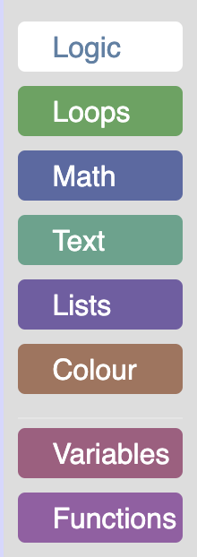

import ClassBlock from '@site/src/components/ClassBlock';

# Customizing a Blockly toolbox

## 4. Change the look of a selected category

Open your `index.html` and click on a category. You will see that it
doesn't give any indication that it has been clicked. Worse than that, if you
click on the category a second time the background color will disappear.

To fix this, we are going to override the `setSelected` method to change the look
of a category when it has been clicked. In the default category class this method
adds a colour to the entire row when a category is selected. Since we have already
expanded the colour over our entire div, we are going to change the background
color of the div to white, and the text to the color of the category when it has
been selected.

Add the following code to `custom_category.js`:
```js
/** @override */
setSelected(isSelected){
   // We do not store the label span on the category, so use getElementsByClassName.
   var labelDom = this.rowDiv_.getElementsByClassName('blocklyToolboxCategoryLabel')[0];
   if (isSelected) {
     // Change the background color of the div to white.
     this.rowDiv_.style.backgroundColor = 'white';
     // Set the colour of the text to the colour of the category.
     labelDom.style.color = this.colour_;
   } else {
     // Set the background back to the original colour.
     this.rowDiv_.style.backgroundColor = this.colour_;
     // Set the text back to white.
     labelDom.style.color = 'white';
   }
   // This is used for accessibility purposes.
   Blockly.utils.aria.setState(/** @type {!Element} */ (this.htmlDiv_),
       Blockly.utils.aria.State.SELECTED, isSelected);
}
```

### The result
Open `index.html` and click on the "Logic" category. You should now see a white
category with a colored label.

<ClassBlock className="codelabImages">  </ClassBlock>