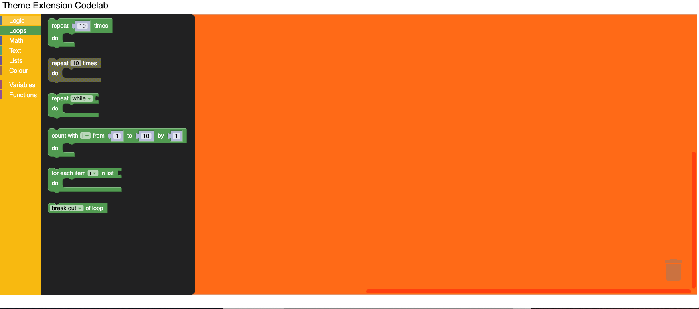

# Customizing your themes

## 5. Customize Category Styles

A category style currently only holds a colour property. It is the colour of the category on the toolbox.
This value can either be defined as a hex value or as a hue. Usually these colours should be the same as
the colourPrimary on the majority of blocks in the category making it easy for users to tell what blocks
belong in what category.

Update the Theme definition to have the category styles as below.

```js
Blockly.Themes.Halloween = Blockly.Theme.defineTheme('halloween', {
  'base': Blockly.Themes.Classic,
  'categoryStyles': {
    'list_category': {
      'colour': "#4a148c"
    },
    'logic_category': {
      'colour': "#8b4513",
    },
    'loop_category': {
      'colour': "#85E21F",
    },
    'text_category': {
      'colour': "#FE9B13",
    }
  },
  'componentStyles': {
    'workspaceBackgroundColour': '#ff7518',
    'toolboxBackgroundColour': '#F9C10E',
    'toolboxForegroundColour': '#fff',
    'flyoutBackgroundColour': '#252526',
    'flyoutForegroundColour': '#ccc',
    'flyoutOpacity': 1,
    'scrollbarColour': '#ff0000',
    'insertionMarkerColour': '#fff',
    'insertionMarkerOpacity': 0.3,
    'scrollbarOpacity': 0.4,
    'cursorColour': '#d0d0d0',
    'blackBackground': '#333'
  }
});

```

### Test it

The colour displayed next to the toolbox category should display your new colours.
Clicking on a category will highlight the row with your new colour.


