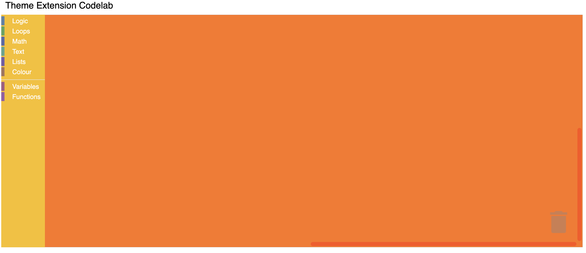

# Customizing your themes

## 4. Customize Components

Within the Halloween theme definition, you can customize the colours of multiple components:

```js
Blockly.Themes.Halloween = Blockly.Theme.defineTheme('halloween', {
  'base': Blockly.Themes.Classic,
  'componentStyles': {
    'workspaceBackgroundColour': '#ff7518',
    'toolboxBackgroundColour': '#F9C10E',
    'toolboxForegroundColour': '#fff',
    'flyoutBackgroundColour': '#252526',
    'flyoutForegroundColour': '#ccc',
    'flyoutOpacity': 1,
    'scrollbarColour': '#ff0000',
    'insertionMarkerColour': '#fff',
    'insertionMarkerOpacity': 0.3,
    'scrollbarOpacity': 0.4,
    'cursorColour': '#d0d0d0',
    'blackBackground': '#333'
  }
});
```

### Test it

Reload your web page. You should see a themed workspace!

