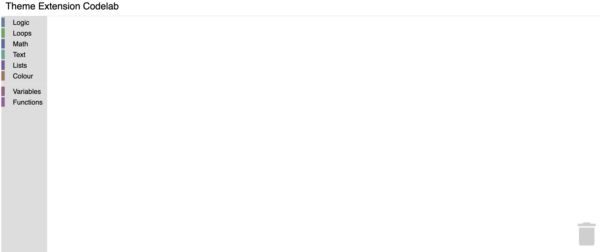

# Customizing your themes

## 2. Setup

### Download the sample code

You can get the sample code for this code by either downloading the zip here:

[Download zip](https://github.com/RaspberryPiFoundation/blockly/archive/main.zip)

or by cloning this git repo:

```bash
git clone https://github.com/RaspberryPiFoundation/blockly.git
```

If you downloaded the source as a zip, unpacking it should give you a root folder named `blockly-main`.

The relevant files are in `docs/docs/codelabs/theme-extension-identifier`. There are two versions of the app:
- `starter-code/`: The starter code that you'll build upon in this codelab.
- `complete-code/`: The code after completing the codelab, in case you get lost or want to compare to your version.

Each folder contains:
- `index.js` - The codelab's logic. To start, it just injects a simple workspace.
- `index.html` - A web page containing a simple blockly workspace.

To run the code, simple open `starter-code/index.html` in a browser. You should see a Blockly workspace with a flyout.

