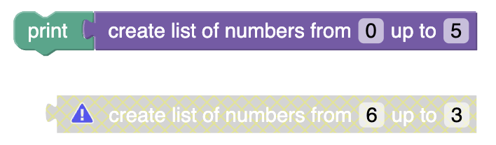

import ClassBlock from '@site/src/components/ClassBlock';

# Block validation and warnings

## 1. Codelab overview

### What you'll learn
This codelab will show you how to ensure that custom blocks either:
1. have everything they need to be able to generate valid code, or
1. display a visual warning to the user that the block is currently invalid.

### What you'll build
In this codelab, you'll create a new custom block type that generates a list of numbers counting up within a given range. The block will validate itself and display a warning if the first number in the range is greater than the last number:

<ClassBlock className="codelabImages"></ClassBlock>

You can find the code for the [completed custom block](https://github.com/RaspberryPiFoundation/blockly/docs/docs/codelabs/validation-and-warnings/complete-code/index.js) on GitHub.

### What you'll need
- A browser.
- A text editor.
- Basic knowledge of JavaScript.
- Basic understanding of the [Blockly toolbox](/blockly/guides/configure/web/toolboxes/toolbox).
- Basic understanding of [using JSON to define custom blocks](/blockly/guides/create-custom-blocks/define/structure-json).