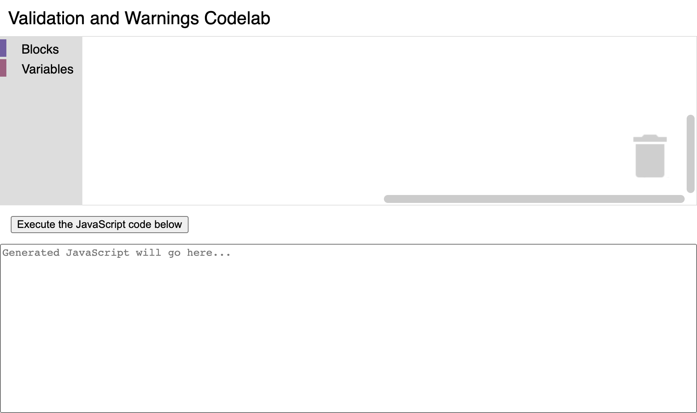
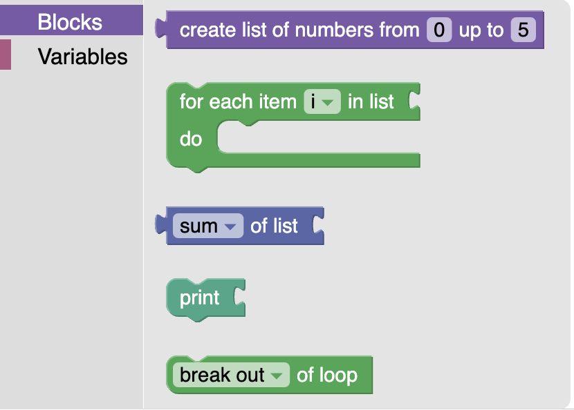
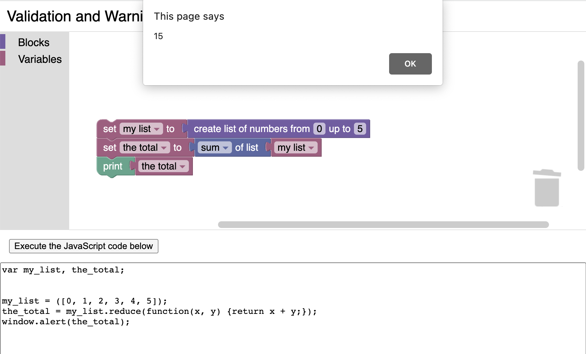

import ClassBlock from '@site/src/components/ClassBlock';

# Block validation and warnings

## 2. Setup

### Download the sample code
You can get the sample code for this codelab by either downloading the zip here:

[Download zip](https://github.com/RaspberryPiFoundation/blockly/archive/main.zip)

or by cloning this git repo:

```bash
git clone https://github.com/RaspberryPiFoundation/blockly.git
```

If you downloaded the source as a zip, unpacking it should give you a root folder named `blockly-main`.

The relevant files are in `docs/docs/codelabs/validation-and-warnings`. There are two versions of the app:
- `starter-code/`: The starter code that you'll build upon in this codelab.
- `complete-code/`: The code after completing the codelab, in case you get lost or want to compare to your version.

Each folder contains:
- `index.js` - The codelab's logic. To start, it just injects a simple workspace.
- `index.html` - A web page containing a simple blockly workspace, an empty space where generated code will be displayed, and a button to execute the generated code.

Open the file `starter-code/index.html` in a browser to see what it looks like. You should see a Blockly workspace with a toolbox, and space below it for generated code.



Next, open the file `starter-code/index.js` in a text editor. You will be making changes to this file, but first let's take a look at the contents. The code in this file already does a few things:
1. It uses Blockly's toolbox JSON API to define a toolbox containing a few built-in blocks that will be useful for testing our custom block.
1. In a function called `start()`, it initializes a Blockly workspace with the above toolbox, and adds a change event listener that displays the generated JavaScript code whenever a block is moved or updated in the workspace.
1. In a function called `executeCode()`, it executes the generated JavaScript code.

### Define a custom block type
To prepare for adding validation, let's define a new custom block type named `list_range` with two number fields called `FIRST` and `LAST`. Copy the following code to the beginning of `index.js`:

```js
// Use Blockly's custom block JSON API to define a new block type.
Blockly.common.defineBlocksWithJsonArray([
  {
    'type': 'list_range',
    'message0': 'create list of numbers from %1 up to %2',
    'args0': [
      {
        'type': 'field_number',
        'name': 'FIRST',
        'value': 0,
      },
      {
        'type': 'field_number',
        'name': 'LAST',
        'value': 5,
      },
    ],
    'output': 'Array',
    'style': 'list_blocks',
  },
]);
```

Then, to make this block available from the toolbox, find the toolbox definition in `index.js` and insert this code at the beginning of the list of available blocks, right before the one named `controls_forEach`:

```js
        {
          'kind': 'block',
          'type': 'list_range',
        },
```

Now, if you reload `index.html` and open the toolbox, you should see the new block at the top:

<ClassBlock className="codelabImages"></ClassBlock>

### Generating JavaScript code for the custom block
You can drag this block out from the toolbox into the workspace, but if you try to use it, you'll find that Blockly doesn't know how to generate JavaScript code from this block yet and error messages will appear in the browser console when it tries to update the display of the generated code. To fix this, add the following code below the custom block definition:

```js
// Define how to generate JavaScript from the custom block.
javascript.javascriptGenerator['list_range'] = function(block) {
  const first = this.getFieldValue('FIRST');
  const last = this.getFieldValue('LAST');
  const numbers = [];
  for (let i = first; i <= last; i++) {
    numbers.push(i);
  }
  const code = '[' + numbers.join(', ') + ']';
  return [code, javascript.Order.NONE];
};
```

Reload `index.html` once again and try adding the new block to the workspace. You should be able to see it successfully generate JavaScript code this time. Try combining it with other blocks to see what the code might look like, and click the button labeled "Execute the JavaScript code below" to see what happens when you run it:



Now we are ready to start adding validation!