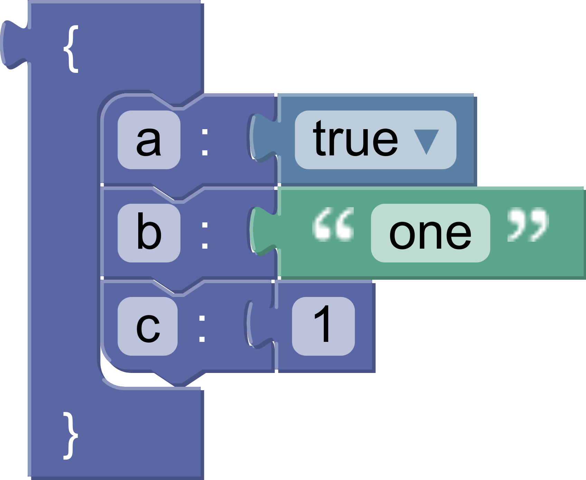

# Build a custom generator

## 8. Object block generator

This section will write the generator for the `object` block and will demonstrate how to use `statementToCode`.

The `object` block generates code for a JSON Object. It has a single statement input, in which member blocks may be stacked.



The generated code looks like this:

```json
{
  "a": true,
  "b": "one",
  "c": 1
}
```

### Get the contents

We'll use `statementToCode` to get the code for the blocks attached to the statement input of the `object` block.

`statementToCode` does three things:

- Finds the first block connected to the named statement input (the second argument)
- Generates the code for that block
- Returns the code as a string

In this case the input name is `'MEMBERS'`.

```js
const statement_members = generator.statementToCode(block, 'MEMBERS');
```

### Format and return

Wrap the statements in curly brackets and return the code, using the default precedence:

```js
const code = '{\n' + statement_members + '\n}';
return [code, Order.ATOMIC];
```

Note that `statementToCode` handles the indentation automatically.

### Test it

Here is the full block generator:

```js
jsonGenerator.forBlock['object'] = function (block, generator) {
  const statementMembers = generator.statementToCode(block, 'MEMBERS');
  const code = '{\n' + statementMembers + '\n}';
  return [code, Order.ATOMIC];
};
```

Test it by generating code for an `object` block containing a single `member` block. The result should look like this:

```json
{
  "test": true
}
```

Next, add a second member block and rerun the generator. Did the resulting code change? Let's look at the next section to find out why not.
