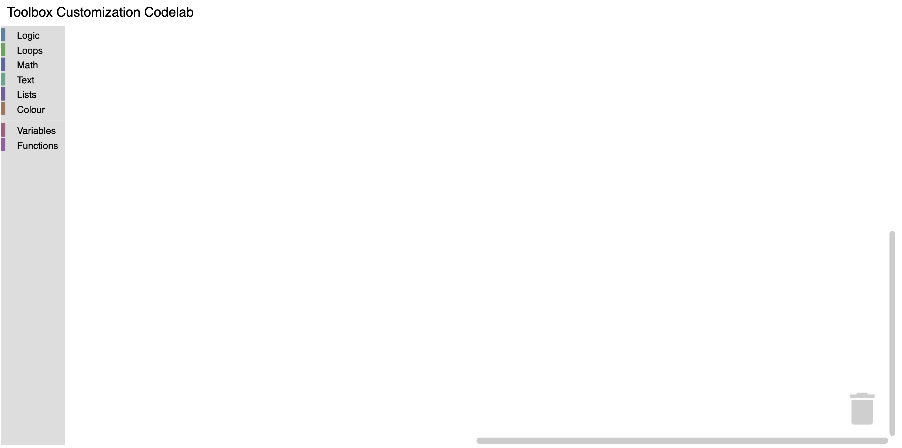

import CodelabImage from '@site/src/components/CodelabImage';

# Customizing a Blockly toolbox

## 2. Setup

### Download the sample code

You can get the sample code for this codelab by either downloading the zip here:

[Download zip](https://github.com/RaspberryPiFoundation/blockly/archive/main.zip)

or by cloning this git repo:

```bash
git clone https://github.com/RaspberryPiFoundation/blockly.git
```

If you downloaded the source as a zip, unpacking it should give you a root folder named `blockly-main`.

The relevant files are in `docs/docs/codelabs/custom-toolbox`. There are two versions of the app:

- `starter-code/`: The starter code that you'll build upon in this codelab.
- `complete-code/`: The code after completing the codelab, in case you get lost or want to compare to your version.

Each folder contains:

- `index.js` - The codelab's logic. To start, it just injects a simple workspace.
- `index.html` - A web page containing a simple blockly workspace.

To run the code, simply open `starter-code/index.html` in a browser. You should see a Blockly workspace with a toolbox.



### Define and register a custom category

To start, create a file named `custom_category.js` in the `starter-code`
directory. Include your new file by adding a script tag to `index.html`.

```html
<script src="custom_category.js"></script>
```

In order to create a custom category we will create a new category that extends
the default `Blockly.ToolboxCategory` class. Add the following code to your
`custom_category.js` file.

```js
class CustomCategory extends Blockly.ToolboxCategory {
  /**
   * Constructor for a custom category.
   * @override
   */
  constructor(categoryDef, toolbox, opt_parent) {
    super(categoryDef, toolbox, opt_parent);
  }
}
```

After defining your category you need to tell Blockly that it exists.
Register your category by adding the below code to the end of `custom_category.js`.

```js
Blockly.registry.register(
  Blockly.registry.Type.TOOLBOX_ITEM,
  Blockly.ToolboxCategory.registrationName,
  CustomCategory,
  true,
);
```

By registering our `CustomCategory` with `Blockly.ToolboxCategory.registrationName`
we are overriding the default category in Blockly. Because we are overriding a
toolbox item instead of adding a new one, we must pass in `true` as the last
argument. If this flag is `false`, `Blockly.registry.register` will throw
an error because we are overriding an existing class.

### The result

To test, open `index.html` in a browser. Your toolbox should look the same as it
did before.

<CodelabImage>
  {' '}
  {' '}
</CodelabImage>

However, if you run the below commands in your console you will see that
your toolbox is now using the `CustomCategory` class.

```js
var toolbox = Blockly.common.getMainWorkspace().getToolbox();
toolbox.getToolboxItems()[0];
```
