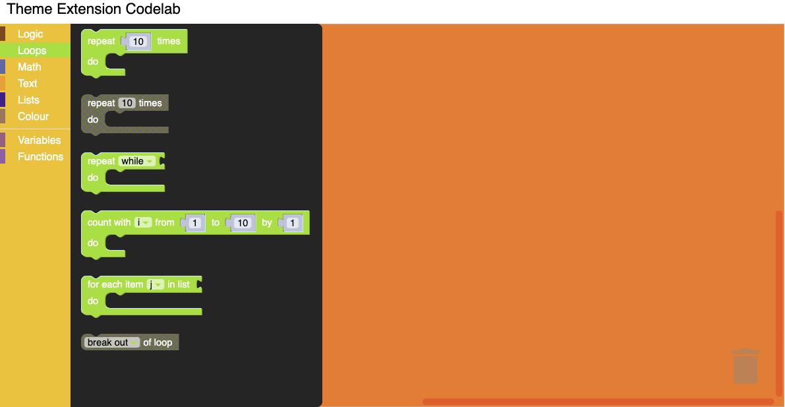

# Customizing your themes

## 6. Customize Block Styles

A block style currently only holds three different colour properties. They are 'colourPrimary',
'colourSecondary' and 'colourTertiary'. This value can either be defined as a hex value or as a hue.
For more information on block styles visit our themes [documentation](/guides/configure/web/appearance/themes#block-style)

Update the Theme definition to have the block styles as below.

```js
Blockly.Themes.Halloween = Blockly.Theme.defineTheme('halloween', {
  base: Blockly.Themes.Classic,
  categoryStyles: {
    list_category: {
      colour: '#4a148c',
    },
    logic_category: {
      colour: '#8b4513',
    },
    loop_category: {
      colour: '#85E21F',
    },
    text_category: {
      colour: '#FE9B13',
    },
  },
  blockStyles: {
    list_blocks: {
      colourPrimary: '#4a148c',
      colourSecondary: '#AD7BE9',
      colourTertiary: '#CDB6E9',
    },
    logic_blocks: {
      colourPrimary: '#8b4513',
      colourSecondary: '#ff0000',
      colourTertiary: '#C5EAFF',
    },
    loop_blocks: {
      colourPrimary: '#85E21F',
      colourSecondary: '#ff0000',
      colourTertiary: '#C5EAFF',
    },
    text_blocks: {
      colourPrimary: '#FE9B13',
      colourSecondary: '#ff0000',
      colourTertiary: '#C5EAFF',
    },
  },
  componentStyles: {
    workspaceBackgroundColour: '#ff7518',
    toolboxBackgroundColour: '#F9C10E',
    toolboxForegroundColour: '#fff',
    flyoutBackgroundColour: '#252526',
    flyoutForegroundColour: '#ccc',
    flyoutOpacity: 1,
    scrollbarColour: '#ff0000',
    insertionMarkerColour: '#fff',
    insertionMarkerOpacity: 0.3,
    scrollbarOpacity: 0.4,
    cursorColour: '#d0d0d0',
    blackBackground: '#333',
  },
});
```

### Test it

Click on different blocks in the component and you should see the colours that you applied show up.


